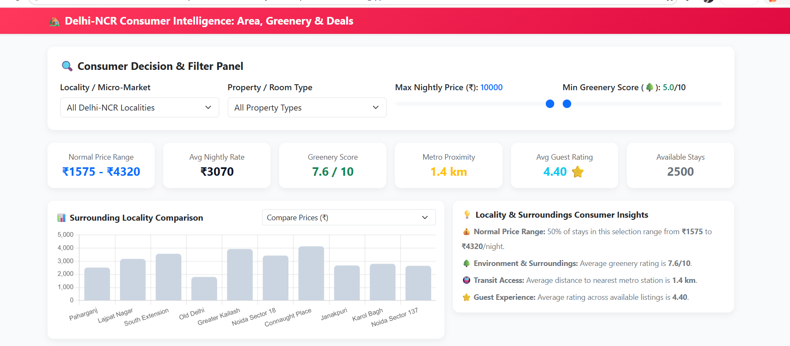
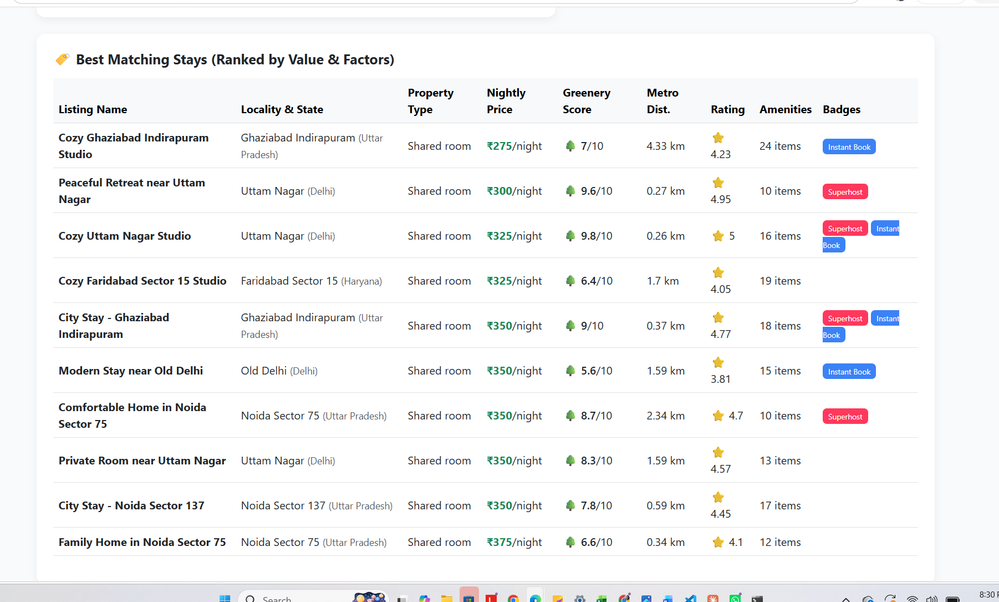

# Delhi-NCR Airbnb Analytics & Consumer Market Intelligence App

An end-to-end data analytics and interactive web application designed to evaluate listing trends, pricing dynamics, metro proximity, guest ratings, and neighborhood surroundings (greenery scores) across the Delhi-NCR Airbnb market.

---

##  Live Interactive Application

Click below to open and test the live application directly in your browser:

👉 **[Launch Live Consumer Dashboard](https://vaishnavi698.github.io/delhi-ncr-airbnb-analytics/)**

---

## 📸 Application Layout & Preview

| 1. Consumer Filter & Decision Panel | 2. Surroundings Comparison & Ranked Stays |
| :---: | :---: |
|  |  |

---

## 📌 Key Analytics & Features

* **Multi-Factor Filtering:** Dynamically filter listings by micro-market (neighbourhood), property/room type, maximum budget, and minimum greenery score.
* **Real-Time Market Benchmarking:** Instant calculation of normal price range (interquartile range), average nightly rates, average metro distance, and guest satisfaction ratings.
* **Surrounding Locality Comparisons:** Interactive bar charts comparing localities by Nightly Price (₹), Greenery Index (🌳), and Transit Proximity (km).
* **Smart Value Deal Engine:** Ranked listing table highlighting top bargains with badges for Superhosts and Instant Bookable properties.

---

## 🛠️ Project Structure

```text
delhi-ncr-airbnb-analytics/
├── assets/
│   ├── dashboard_preview_1.png      # Top panel screenshot
│   └── dashboard_preview_2.png      # Charts & tables screenshot
├── data/
│   └── processed/
│       ├── delhi_ncr_airbnb_realistic.csv
│       └── consumer_app.html        # Output standalone app
├── scripts/
│   └── generate_consumer_app.py     # Python data pipeline script
├── README.md                        # Documentation
└── index.html                       # Entry point for GitHub Pages

---


## 🚀 How to Run Locally

### 1. **Clone the Repository**
You can find the project repository here: [delhi-ncr-airbnb-analytics](https://github.com/Vaishnavi698/delhi-ncr-airbnb-analytics.git)

Open your terminal and run the following commands to clone the project and navigate into the folder:

```bash
git clone https://github.com/Vaishnavi698/delhi-ncr-airbnb-analytics.git
cd delhi-ncr-airbnb-analytics
```


---


## 🧰 Tech Stack

| Category | Technologies Used |
| :--- | :--- |
| **Data Processing** | 🐍 Python, Pandas, NumPy, JSON |
| **Frontend Application** | 🌐 HTML5, CSS3, JavaScript (ES6) |
| **UI & Visualizations** | 📊 Bootstrap 5, Chart.js |
